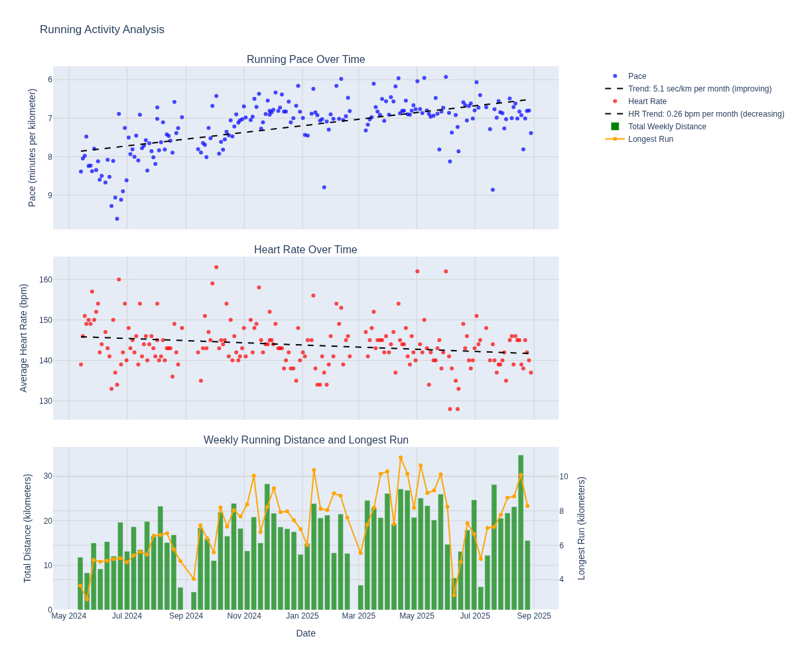

# garmin-activity-analyzer

## Usage

Install dependencies

    uv sync

Download all activities

    uv run get_activities.py

Analyze runs

    uv run python plot_summary.py

This should produce something like this

